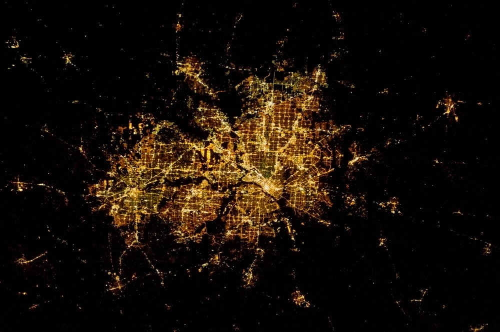
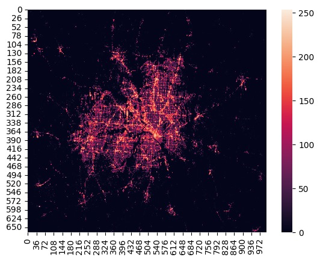

# SocioEconomic Analysis of Cities

## Tagline
Beyond the Dark: Nighttime Images Reveal City Secrets

The project explores the potential of nighttime satellite imagery for socioeconomic analysis in cities by analyzing variations in light intensity.

## Overview

This project aims to develop a website for analyzing poverty levels in urban areas based on nighttime satellite imagery. By leveraging advanced image processing techniques and machine learning models, we seek to provide valuable insights into socio-economic conditions using readily available nighttime data.

## Key Features

1. **User Interface (UI)**
   - **Image Upload**: Users can upload nighttime satellite images for a specific region through an intuitive user interface.

2. **Pre-processing**
   - **Format Check**: The website performs a basic check to ensure the uploaded image is in a compatible format (e.g., JPG, PNG) and considers geospatial referencing.

3. **Image Processing**
   - **Nighttime Lights Extraction**: Core processing involves isolating nighttime lights data from the uploaded image. Techniques like thresholding or image segmentation, along with convolutional neural networks (CNNs), are employed.
   - **Light Intensity Analysis**: The website analyzes the intensity of extracted nighttime lights, correlating brighter areas with higher concentrations of artificial light sources, potentially linked to population density or economic activity.

4. **Poverty Estimation**
   - **Training Data**: Utilizing a large dataset with nighttime light data and corresponding poverty indicators for various regions.
   - **Machine Learning Model**: A machine learning model is trained to establish a relationship between nighttime light intensity and poverty levels. This model estimates poverty based on processed nighttime light images uploaded by users.

5. **Visualization and Output**
   - **Poverty Map**: The website generates a poverty map of the uploaded region, highlighting areas with higher or lower estimated poverty levels using color coding or heatmaps.
   - **Insights and Interpretation**: Users are provided with insights based on the processed data, such as highlighting areas of potential concern or offering suggestions for further investigation.

## Challenges
1. **Data Acquisition**: Finding free, high-resolution nighttime satellite imagery with good historical coverage.
2. **Data Quality**: Addressing factors like cloud cover and seasonal variations in lighting that affect data quality.
3. **Data Volume and Processing Power**: Analyzing large volumes of satellite imagery requires significant computational resources.

## Demo

### Input Image

### Output Image (Poverty Map)

## Contribution

Contributions to this project, whether through feedback, suggestions, or code contributions, are highly appreciated. Together, we can harness the potential of nighttime satellite imagery to address socio-economic challenges in cities.

## License

This project is licensed under the [GNU General Public License version 3.0 (GPL-3.0)](LICENSE).

